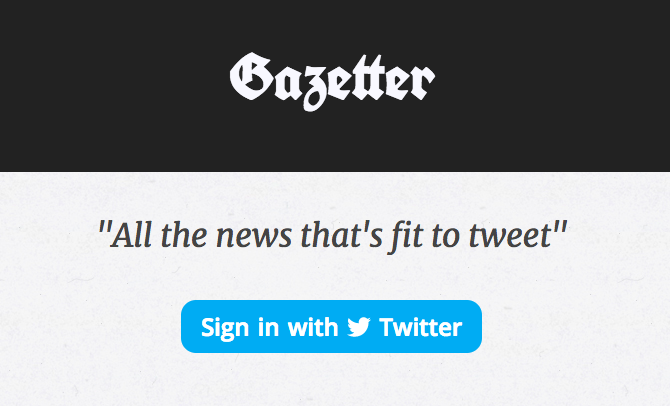
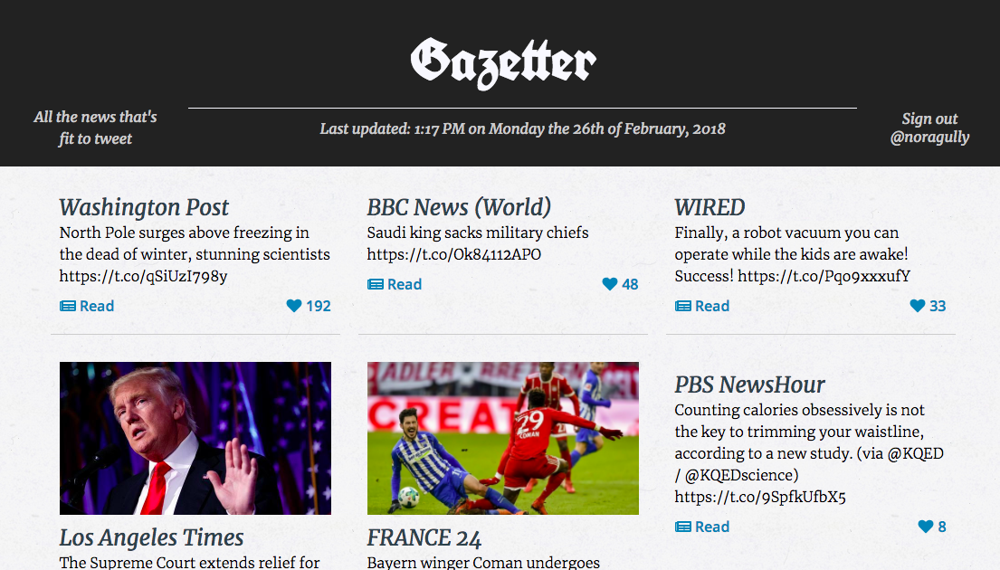

# Twitter Gazette

### Project Pitch
- Gazetter is for people who like to read the news through Twitter and yet find the newsfeed overwhelming. 
- For every user, the app will curate their most relevant newsworthy tweets from the Twitter API based on features such as: likes, retweets, credentials, proximity, etc. 
- Gazetter pulls in tweet content as headlines for a "front page" of a newspaper that is independent of news outlets. 
- Eventually it will have sections like a traditional newspaper, such as Local News. 
- The desktop design will mimic that of a print newspaper. 
- The mobile site will have some of the same flourishes as the desktop but be optimized for people on the go.

### Stack / Learning Goals
- React
- Redux
- Router
- Firebase Authentication (learned solo)
- Express / Node.js backend at https://github.com/nogully/gazetter-backend (learned solo)
- Testing suite in Jest and Enzyme

### Screenshots
  

  

### To run this repo: 
- You need a Twitter account to log in
- You need an API key from Twitter
- You need to sign up with Firebase
- Clone this repo and do `npm install`
- Clone the backend and ditto: https://github.com/nogully/gazetter-backend
- Run the back end with `npm start` before you start the frontend
- You'll have to handle your own firebase authentication:
```
import firebase from 'firebase';

const config = {
    apiKey: "Fill this in",
    authDomain: "Fill this in",
    databaseURL: "Fill this in",
    projectId: "Fill this in",
    storageBucket: "Fill this in",
    messagingSenderId: "Fill this in"
};

firebase.initializeApp(config);

export const provider = new firebase.auth.TwitterAuthProvider();

export const auth = firebase.auth();

export const signIn = () => firebase.auth().signInWithPopup(provider);

export const signOut = () => firebase.auth().signOut(provider);

export default firebase;
```

### To run the testing suite: 
`npm test`
